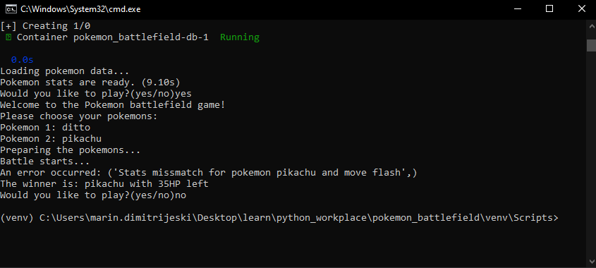

### Pokémon Duel Simulation Project Documentation

---

#### Overview

This Pokémon Duel Simulation project is a Python-based application designed to simulate battles between Pokémon characters. The project leverages data fetching, caching, object-oriented programming, and asynchronous features to create an interactive and performant simulation environment.

---

---

#### Key Components

- **`main.py`**: Serves as the entry point of the application, orchestrating the simulation flow, including initializing data, setting up the battlefield, and executing Pokémon duels. Also provides seamless simulation execution by skipping most of the errors that can occur due to the missmatch of some moves for example, but also it is restricted to up to 3 errors.

- **Data Fetching and Models**:
  - **`fetch_poke_data.py`**: Handles fetching Pokémon data from external sources and populating the application's cache with initial data.
  - **`pokemon.py`**, **`move.py`**, **`affecting_move.py`**: Define the data models for Pokémon, their moves, and effects and behaviour of moves during battles.

- **Battle Logic and Notes**:
  - **`battle_notes.py`**: Records and manages notes or logs of battle outcomes, providing insights into each duel's flow and results.
  - **`exceptions.py`**: Custom exception definitions for error handling within the simulation's unique contexts.

- **Database and Persistence**:
  - **`database.py`**: Manages database connections and operations, supporting data persistence for the simulation.
  - Dimensional and fact tables such as **`dim_pokemon.py`**, **`dim_stats.py`**, **`fact_attack.py`**, and **`fact_battle.py`** model the data structure for storing Pokémon attributes, battle statistics, and historical data.

- **Repositories**:
  - **`dim_pokemon_repository.py`**, **`dim_stats_repository.py`**, **`dim_move_repository.py`**: Abstract the data access layer, facilitating interaction with the database for fetching and storing Pokémon, their stats, and moves data.

- **`__init__.py`**: Marks the directory as a Python package, allowing for modular import of components.

---

#### Setup and Execution(without Docker)

- Ensure Python 3.9+ is installed.
- Install required dependencies (listed in a requirements.txt file, if provided).
- Create and migrate PostgreSQL database.
- Run `main.py` to start the simulation. The script will fetch initial Pokémon data, set up the battlefield, and initiate battles based on predefined or random matchups.

---

#### Docker Support

- **`Dockerfile`** and **`docker-compose.yml`** are provided for containerization, offering an easy setup and execution environment without the need for local Python setup.
- Use `docker-compose build` and `docker-compose up` to build and run the application in containers, ensuring an isolated and consistent environment.

---

This documentation provides a high-level overview of the Pokémon Duel Simulation project's structure and functionality. For detailed implementation details, refer to comments and docstrings within each module.
